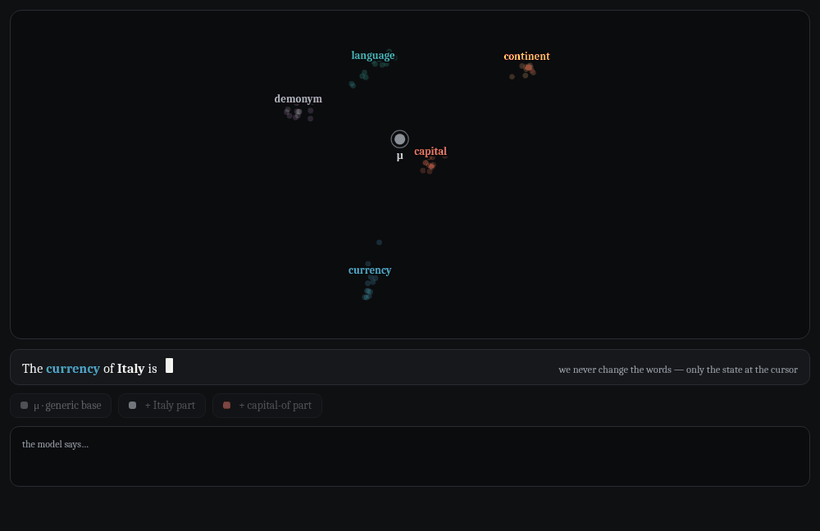

---
hide:
  - navigation
  - toc
---

# El pensamiento está hecho de piezas

Desarmamos el pensamiento de un modelo de lenguaje — <em>"la capital de
Italia"</em> — en tres ingredientes promediados, lo volvimos a armar, escribimos el estado
ensamblado en un solo punto adentro del modelo… y dijo <b>"Rome"</b>. Cambiá la pieza de Italia
por la de Francia y dice <b>"Paris"</b>. Empujá la misma perilla 4× de más y balbucea — pero
todavía <em>sabe</em> la respuesta.

[:material-play-circle: Miralo ensamblarse](assembly.md){ .md-button .md-button--primary }
[:material-school: Explicado fácil](explained.md){ .md-button }
[:material-file-document: El paper (PDF)](assets/paper.pdf){ .md-button }
[:material-flask: Evidencia y controles](evidence.md){ .md-button }
[:material-github: Código](https://github.com/mpodeley/jspace-qwen){ .md-button }

## Los números

52% ≈ 53%un pensamiento
ensamblado desde partes promediadas hace que el modelo diga la respuesta a su propio techo de
precisión (8B: 62% vs 68%)

20/20 × 3cada swap
ordenado de relación cambia el margen de respuesta en Qwen3-1.7B, Qwen3-8B y Gemma-2-9B; nulos
de etiquetas permutadas ≈ 0

80%incluso con sobredosis
4× — donde el habla fluida colapsa en loops — la respuesta correcta gana la elección
forzada

3 × 2tres modelos, dos
dominios (geografía, taxonomía animal) donde funciona — y dos (aritmética, lógica) donde
probadamente no

!!! note "El null honesto con el que empezó todo"
    Este proyecto nació como réplica de un claim de "subespacio legible" — que **no** replicó
    bajo controles pareados. La estructura que se reporta acá es organización *causal*, validada
    contra nulos que conservan toda la estadística del método destruyendo su significado. Cada
    claim está junto al control que podría haberlo matado en
    [Evidencia y controles](evidence.md).

---

**Paper:** *Operator–Operand Factorization in LLM Residual Streams: Causal Influence and
Compositional Sufficiency* — [PDF](assets/paper.pdf) · [abstract y BibTeX](paper.md) ·
[código y reproducibilidad](https://github.com/mpodeley/jspace-qwen) ·
[qué sigue](future.md)

Matias Podeley · investigador independiente · <mpodeley@gmail.com> · licencia MIT ·
aprendé el campo en español: [Interpretabilidad Mecanicista](https://mpodeley.github.io/interpretabilidad-mecanicista/)
